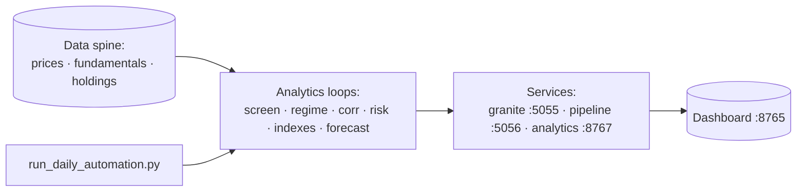

# Stock Monitor — Portfolio, Indexes, Analytics & Forecasting

Python + DuckDB toolkit and a **DuckDB-Wasm / Chart.js dashboard** for personal portfolio tracking, fertilizer & defensive indexes, value screens, sector structure, Granite TTM forecasts, anomaly detection, and chained Fisher price/quantity indexes.

Built iteratively from Robinhood trade extracts through sector-rotation research, fundamental screens (P/B, MktCap/Assets, EV/EBITDA), correlation/HMM/Kalman/VAR analytics, and IBM Granite Time Series–style forecasting.

---


## Strategic overview

Read **[docs/SYSTEM_OVERVIEW.md](docs/SYSTEM_OVERVIEW.md)** for a holistic summary of the stack, screens, risk budgets, regime tools, and a 10-year dynamic-fund design vs the S&P 500, plus future quant and integration work.

**Docs map:**
- **[docs/SYSTEM_ORCHESTRATION.md](docs/SYSTEM_ORCHESTRATION.md)** — how the programs chain (data spine → analytics → services), what `start_dashboard.sh` launches, and what an agent should know before running analytics.
- **[docs/SCHEMAS.md](docs/SCHEMAS.md)** — the single catalog of every output file → producing script → schema family.
- **Per-program docs:** `docs/<script>.md` for all 130 scripts (description, rationale, outputs, cross-links).
- **[GLOSSARY.md](https://github.com/derekm/stockmagic/blob/master/GLOSSARY.md)** — cross-repo acronym dictionary (root of the stockmagic repo, covers both repos).
- **Diagrams:** `docs/diagrams/*.png` (+ Mermaid sources) — framework architecture, daily-automation DAG, signal stack, regime-selected forecasting pipeline; `render_mermaid.py` re-renders them.

**Documentation architecture (read in this order):**

1. **SYSTEM_OVERVIEW.md** — *why*: investment thesis, the screen/risk/regime theory, and how the layers form feedback loops.
2. **SYSTEM_ORCHESTRATION.md** — *how*: the exact data spine → analytics → four-services chaining, plus what an agent must know before running anything.
3. **SCHEMAS.md** — *what*: the single catalog of every output file → producing script → schema family (the families encode the module theory).
4. **docs/`<script>.md`** — one doc per script (description, rationale, outputs, related programs).
5. **AGENTS.md** — operating rules for agents touching this repo.

The **data spine** (`daily_prices`, `fundamentals`, `monitored_stocks`, `portfolio_holdings`, `trades`, `exogenous_panel`, and the S&P tables) is the only shared input; everything else is a derived output catalogued in SCHEMAS.md.



> Full data-flow + service map (with the per-loop script list): **[docs/SYSTEM_ORCHESTRATION.md](docs/SYSTEM_ORCHESTRATION.md)**. Stack theory & 10-yr design: **[docs/SYSTEM_OVERVIEW.md](docs/SYSTEM_OVERVIEW.md)**. Output catalog: **[docs/SCHEMAS.md](docs/SCHEMAS.md)**.

## Quick start

```bash
cd stock_monitor

# Core data
python update_prices.py --fetch --days 5          # or --manual / --from-csv
python backfill_historical.py --period 1y        # when network allows
python update_fundamentals.py                    # valuation fields

# Indexes & analytics
python build_index.py
python build_defensive_index.py
python maintain_analytics.py all
python cross_asset_analysis.py all

# Fisher (DuckDB is system of record)
python run_fisher_duckdb.py --universe portfolio --save
python run_fisher_duckdb.py --sector Materials --save

# Forecasts (offline fallback if Granite weights missing)
python forecast_granite.py forecast --index portfolio --from-first-trade --horizon 10

# Dashboard (granite_service + pipeline_service + analytics_service + static site)
./start_dashboard.sh
# → http://127.0.0.1:8765/index.html  (Ctrl+C to stop; ports overridable via env)

## How to update / re-run (kick things off)

**Full daily refresh (recommended):** run the master orchestrator, or trigger it from the dashboard
```bash
python run_daily_automation.py   # 40+ jobs: hmm → rebalance → preferred → implied_r → momentum → inclusion → stress → crisis → factor_rot → risk_enrich → rolling → rolling_corr → tail_hedge → allpairs → fund_snap → screen_bt → dupont → growth → peer → earnings → pairs → cross → aggregate → technical → econ_cal → est_rev → shadow → taleb_tail → taleb_gap → taleb_iv_skew → taleb_ergodic → taleb_fragility → taleb_minsky → taleb_shock → taleb_sector_shock → taleb_shock_ride → taleb_subindustry_regime → taleb_barbell → taleb_optionality → **polygon_prices** → export
# or from the dashboard Ops tab: analytics_service POST /run/all-daily
```
Selective: `python run_daily_automation.py --only inclusion,stress,export` (valid job names: `hmm, rebalance, preferred, implied_r, momentum, inclusion, stress, crisis, factor_rot, risk_enrich, rolling, rolling_corr, tail_hedge, allpairs, fund_snap, screen_bt, dupont, growth, peer, earnings, pairs, cross, aggregate, technical, econ_cal, est_rev, shadow, taleb_tail, taleb_gap, taleb_iv_skew, taleb_ergodic, taleb_fragility, taleb_minsky, taleb_shock, taleb_sector_shock, taleb_shock_ride, taleb_subindustry_regime, taleb_barbell, taleb_optionality, **polygon_prices**, export`).

**Refresh just the data:**
```bash
python update_prices.py --fetch --days 5        # append latest OHLCV
python update_fundamentals.py                   # refresh valuation fields
```

**Refresh the dashboard tables only:**
```bash
python export_dashboard_data.py                 # rewrites dashboard_data/data.json
```

**Re-run forecasts (needs pretrained checkpoints under checkpoints/):**
```bash
python granite_backfill.py         # one-time / when history grows (warm-starts adjusted ckpt)
python granite_daily.py            # daily 512→96 forecast + continual retrain
python forecast_granite.py forecast --index portfolio --from-first-trade --horizon 10
```

**Restart the dashboard:** stop the running `./start_dashboard.sh` (Ctrl+C) and start it again.

See **[docs/SYSTEM_ORCHESTRATION.md](docs/SYSTEM_ORCHESTRATION.md)** for the full data-flow and service map.


## S&P 500 membership, tracking & real backfill

The current S&P 500 universe lives in **`sp500_constituents.parquet`** (503
names, real GICS sector/sub-industry + `date_added`, sourced from Wikipedia).
`monitored_stocks.parquet` carries `sp500_member` reconciled against that
authoritative list (ADRs/ETFs like BAYRY/HMC/SHEL/VNQ were corrected out).

Tracking / methodology modules (read `fundamentals.parquet` dynamically, so
coverage grows as fundamentals are filled):
- `sp_index_methodology.py` — our independent S&P-style inclusion reimplementation
  (size/liquidity, profitability, sector factors) + dual_strong / dual_weak tiers,
  compared to real `sp500_member` actuals (`compare_to_actuals`).
- `sp_universe_tracking.py` — one row per constituent with GICS vertical/basket
  + scored tiers where fundamentals exist; `unscored` otherwise (honest, not fabricated).
- `sp_history_simulation.py` — quarterly rebalance simulation tracking predicted
  vs reconstructed actual membership (additions from `date_added`; removals are a
  known gap — Wikipedia only exposes current + addition dates).

### Fill real fundamentals + prices via yfinance (real, multi-snapshot)
`backfill_constituents.py` pulls **real** quarterly financials + 5y price history
for the ~409 constituents missing from `fundamentals.parquet`, derives the canonical
quality metrics per quarter-end (roe, roic, debt_to_equity, interest_coverage,
ev_ebitda, mktcap_to_assets, pb_ratio), and is resume-safe:

```bash
python backfill_constituents.py run            # backfill all missing (long, rate-limited)
python backfill_constituents.py run --limit 20  # smoke test
python backfill_constituents.py status          # resume progress
python backfill_constituents.py merge           # union staging -> fundamentals.parquet + daily_prices.parquet
```

Backfilled rows are stamped `source='yfinance'`. We do NOT synthesize history
(`fundamentals_history.py`'s noise backfill is separate and not used here).

---

## What this system covers

| Area | Capability |
|------|------------|
| **Portfolio** | Trades → holdings, P&L, weights, first-trade anchored forecasts |
| **Indexes** | Fertilizer EW, defensive value EW, **growth/tech (high-risk)**, personal sleeve backtests |
| **Valuation** | P/B, MktCap/Assets, EV/EBITDA, value trifecta inclusion screen |
| **Sectors** | Correlation matrices, rolling/stability, HMM regimes, Granger, Kalman |
| **Signals** | Preferred/peer/cross/pairs/earnings families → **OOS-IC-weighted aggregator** + GradientBoosting blend; technical (RSI/MACD/Bollinger), options skew & put/call, estimate revisions, 8-K filings sentiment |
| **Forecasting** | Granite TTM (or statistical fallback), multivariate, exogenous, sector EW, **regime-selected models** (pass5/6/7/8), **Student-t MC-dropout uncertainty** (`forecast_nu`), **dials of doubt** (`--epistemic-error`), per-span direction accuracy (H+10..96) |
| **Anomalies** | TSPulse-ready + statistical z-score / dispersion shocks |
| **Taleb layer** | Fat-tail index (`tail_index`), gap risk (`gap_risk`), fragility veto (`fragility_screen`) + macro debt fragility (`macro_fragility`) + macro supply-shock layer (`macro_shock`), ergodicity/ruin (`ergodicity_ruin`), barbell check (`barbell_check`), **hidden-optionality audit** (`hidden_optionality_audit` — decision flip rates); soft-stress posterior + noise-convolved decisions in `buy_candidates` |
| **Fisher indexes** | Chained Laspeyres / Paasche / Fisher P&Q + √(Fp×Fq) nominal |
| **Costs & execution** | Cost model (10bps + borrow) in backtests; **shadow book** paper-trading with FIFO lots + kill switches; perf metrics (Sharpe/Sortino/Calmar/capacity) |
| **Dashboard** | Decision memos, SQL Lab, CSV catalog, Chart.js, DuckDB-Wasm Fisher, Sprint Engines tab |

### Decision themes (portfolio inclusion)

Documented in the dashboard **Decisions** tab and analysis history:

1. **MOS** preferred over CF on P/B, MktCap/Assets, EV/EBITDA for fertilizer value  
2. **SHEL** as low-EV integrated major with dividend coverage  
3. **FMC** deep book value — check EBITDA quality before size  
4. **Value trifecta** filter: EV/EBITDA ≤ 9, P/B ≤ 1.5, MktCap/Assets ≤ 0.5  
5. **Materials** as diversifier vs Staples/Health Care (rolling corr can spike)  
6. Portfolio already value-tilted; the growth/tech sleeve is the intentional high-vol outlier  |
7. Sector EW (`SECT_*`) forecasts for rotation without single-name noise  

---

## Program READMEs

Detailed usage for each module:

### Data & registry
- [docs/update_prices.md](docs/update_prices.md) — daily OHLCV updates (volume = Fisher quantity)
- [docs/backfill_historical.md](docs/backfill_historical.md) — historical backfill
- [docs/manage_stocks.md](docs/manage_stocks.md) — monitored universe & flags
- [docs/update_fundamentals.md](docs/update_fundamentals.md) — P/B, EV/EBITDA, assets

### Indexes & portfolio
- [docs/build_index.md](docs/build_index.md) — fertilizer index
- [docs/build_defensive_index.md](docs/build_defensive_index.md) — defensive value index
- [docs/build_growth_tech_index.md](docs/build_growth_tech_index.md) — **higher-risk growth/tech index (4th sleeve)**
- [docs/growth_tech_analytics.md](docs/growth_tech_analytics.md) — growth/tech full analysis suite
- [docs/portfolio_report.md](docs/portfolio_report.md) — holdings & P&L
- [docs/kelly.md](docs/kelly.md) — fractional Kelly sizing
- [docs/vol_target.md](docs/vol_target.md) — **per-name volatility targeting** (growth_ai sleeve)
- [docs/risk_parity_analytics.md](docs/risk_parity_analytics.md) — vol target vs risk parity CSVs
- [docs/portfolio_optimization.md](docs/portfolio_optimization.md) — **ERC risk parity + GMV**
- [docs/robust_covariance.md](docs/robust_covariance.md) — robust covariance (Ledoit-Wolf, OAS, EWMA)
- [docs/black_litterman.md](docs/black_litterman.md) — Black-Litterman views & weights
- [docs/alerts_fundamentals.md](docs/alerts_fundamentals.md) — trifecta / fundamental alerts
- [docs/preferred_metrics.md](docs/preferred_metrics.md) — **Buffett ROE/ROIC + trifecta + sizing**
- [docs/dupont_analysis.md](docs/dupont_analysis.md) — DuPont ROE drivers
- [docs/dual_screen_analysis.md](docs/dual_screen_analysis.md) — why dual-pass is rare + external candidates
- [docs/fundamentals_history.md](docs/fundamentals_history.md) — **time-series fundamentals & screen backtests**
- [docs/analytics_service.md](docs/analytics_service.md) — **dashboard microservices (prices/metrics/export)**
- [docs/inclusion_criteria.md](docs/inclusion_criteria.md) — **inclusion/exclusion rules & candidacy tables**
- [docs/run_daily_automation.md](docs/run_daily_automation.md) — **master daily automation**
- [docs/stress_dual_pass.md](docs/stress_dual_pass.md) — dual-pass stress tests
- [docs/allpairs_correlations.md](docs/allpairs_correlations.md) — dense ALLPAIRS corr history
- [docs/crisis_correlation.md](docs/crisis_correlation.md) — crisis correlation breakdown
- [docs/factor_rotation_defense.md](docs/factor_rotation_defense.md) — defensive factor rotation
- [docs/regime_aware_constraints.md](docs/regime_aware_constraints.md) — regime-aware dual-pass thresholds
- [docs/buffett_capital_allocation.md](docs/buffett_capital_allocation.md) — capital allocation philosophy

### Analytics
- [docs/maintain_analytics.md](docs/maintain_analytics.md) — correlations, HMM, Kalman, VAR, backtests
- [docs/cross_asset_analysis.md](docs/cross_asset_analysis.md) — cross-sector structure & `SECT_*` prices
- [docs/check_alerts.md](docs/check_alerts.md) — alerts

### Forecasting & anomalies
- [docs/forecast_granite.md](docs/forecast_granite.md) — Granite TTM / fallback forecasts
- [docs/granite_service.md](docs/granite_service.md) — **Forecast microservice** for dashboard charts
- [docs/analyze_granite_forecasts.md](docs/analyze_granite_forecasts.md) — forecast summary
- [docs/ttm_features.md](docs/ttm_features.md) — multivariate feature panels
- [docs/ttm_exogenous.md](docs/ttm_exogenous.md) — exogenous market/sector channels
- [docs/tspulse_anomaly.md](docs/tspulse_anomaly.md) — anomaly scan

### Signals, costs & portfolio execution
- [docs/signal_aggregator.md](docs/signal_aggregator.md) — **OOS-IC-weighted signal combination (+ per-regime IC)**
- [docs/signal_model.md](docs/signal_model.md) — supervised GradientBoosting blend (mean IC 0.237 vs composite 0.152)
- [docs/technical_signals.md](docs/technical_signals.md) — RSI/MACD/Bollinger/Keltner/SMA crossovers
- [docs/options_skew.md](docs/options_skew.md) — IV skew + put/call volume ratios
- [docs/estimate_revisions.md](docs/estimate_revisions.md) — consensus EPS/price-target revisions
- [docs/filings_sentiment.md](docs/filings_sentiment.md) — SEC 8-K lexicon sentiment
- [docs/cost_model.md](docs/cost_model.md) — 10bps/side + short borrow in backtests
- [docs/shadow_book.md](docs/shadow_book.md) — **paper trading with FIFO tax lots + kill switches**
- [docs/perf_metrics.md](docs/perf_metrics.md) — Sharpe/Sortino/Calmar/profit factor/turnover/capacity
- [docs/economic_calendar.md](docs/economic_calendar.md) — trading days, expiries, FOMC events
- [docs/update_polygon.md](docs/update_polygon.md) — key-gated Polygon.io ingest

### Regime-selected forecasting research (passes)
- [docs/pass5.md](docs/pass5.md) — Granite-TTM as direction forecaster (honest OOS)
- [docs/pass5_sweep.md](docs/pass5_sweep.md) — 648-experiment training-parameter sweep
- [docs/regime_forecast.md](docs/regime_forecast.md) — regime-conditioned direction accuracy
- [docs/pass6.md](docs/pass6.md) — per-regime models, per-regime parameters (`--head-only`, `--exog`, `--rpt`)
- [docs/pass7.md](docs/pass7.md) — experiment-design matrix (boundary/composition/lr/freshness)
- [docs/pass8.md](docs/pass8.md) — own RPT-pre-trained base (`num_patches=9`, daily `freq_token=8`) + fine-tunes from it
- [docs/regime_serving.md](docs/regime_serving.md) — serving regime checkpoints in production
- [docs/regime_calibrate.md](docs/regime_calibrate.md) — MC-dropout band calibration + coverage training

### Taleb / fat tails
- [docs/tail_index.md](docs/tail_index.md) — tail index / fragility metrics
- [docs/gap_risk.md](docs/gap_risk.md) — gap risk screen
- [docs/fragility_screen.md](docs/fragility_screen.md) — fragility veto (feeds buy_candidates)
- [docs/macro_fragility.md](docs/macro_fragility.md) — macro debt fragility (Keen/Minsky)
- [docs/macro_shock.md](docs/macro_shock.md) — macro supply-shock layer (oil/inflation; the 1973-74 complement)
- [docs/macro_sector_shock.md](docs/macro_sector_shock.md) — sector shock signals (farming inputs/outputs, materials)
- [docs/shock_ride.md](docs/shock_ride.md) — ride explosions, exit before crisis (measured)
- [docs/ride_longevity.md](docs/ride_longevity.md) — early detection of breakouts that become LONG rides; quality gate (no 12mo history needed), dual-condition exit, backtest evidence
- [docs/ride_history.md](docs/ride_history.md) — point-in-time recommended ride trade history per ticker
- [docs/backtest_structural.md](docs/backtest_structural.md) — daily backtest of structural/risk-scaled gate paradigms (turtle/volscale/regime/recouple/hybrid/consensus)
- [docs/fractal_windows.md](docs/fractal_windows.md) — fractal sliding-window momentum (patent US20120253946A1, FIGS 28-29); 15d/30d/45d/90d granularity ladder + momentum stack
- [docs/subindustry_regime.md](docs/subindustry_regime.md) — per-subsector correlation/crisis regimes
- [docs/ergodicity_ruin.md](docs/ergodicity_ruin.md) — ergodicity / ruin probability
- [docs/barbell_check.md](docs/barbell_check.md) — barbell portfolio check
- [docs/hidden_optionality_audit.md](docs/hidden_optionality_audit.md) — decision-flip audit (American-options method); drove the soft-stress + noise-convolved decision fixes

### Fisher indexes
- [docs/run_fisher_duckdb.md](docs/run_fisher_duckdb.md) — **DuckDB chained Fisher (preferred)**
- [docs/fisher_index.md](docs/fisher_index.md) — pure-Python Fisher (cross-check)

### Dashboard
- [docs/dashboard.md](docs/dashboard.md) — `index.html`, DuckDB-Wasm, Chart.js, SQL Lab

---

## Core data files

| File | Role |
|------|------|
| `trades.parquet` | Personal fills / DRIPs |
| `portfolio_holdings.parquet` | Aggregated positions |
| `monitored_stocks.parquet` | Universe, sectors, index/portfolio flags |
| `daily_prices.parquet` | OHLCV (volume → Fisher q) |
| `fundamentals.parquet` | Valuation metrics |
| `sector_prices.parquet` | EW sector levels (`SECT_*`) |
| `exogenous_panel.parquet` | mkt/sector exogenous series |
| `fisher_indexes_duckdb.csv` | Chained Fisher series (DuckDB) |
| `forecasts_granite.csv` | Forecast paths |
| `anomalies_tspulse.csv` | Anomaly events |
| `dashboard_data/data.json` | Embedded dashboard tables |

Analytics CSVs (`sector_correlation_matrix.csv`, `index_backtest_stats.csv`, HMM/Kalman/Granger, etc.) are regenerated via `maintain_analytics.py` and mirrored in the dashboard **CSV Catalog**.

---

## Key formulas

The three math primitives this stack is built on:

**Fisher index (quantity-weighted price index)** — see [docs/run_fisher_duckdb.md](docs/run_fisher_duckdb.md):

$$ L_P = \frac{\sum p_t q_{t-1}}{\sum p_{t-1} q_{t-1}},\quad
   P_P = \frac{\sum p_t q_t}{\sum p_{t-1} q_t},\quad
   F_P = \sqrt{L_P \cdot P_P} $$

**Value trifecta (inclusion screen)** — see [docs/preferred_metrics.md](docs/preferred_metrics.md) / [docs/alerts_fundamentals.md](docs/alerts_fundamentals.md):

pass if  EV/EBITDA ≤ 9  and  P/B ≤ 1.5  and  MktCap/Assets ≤ 0.5

$$ included \iff (EV/EBITDA \le 9) \wedge (P/B \le 1.5) \wedge (MktCap/Assets \le 0.5) $$

**Chained level (rolling-base re-anchor)** — see [docs/granite_backfill.md](docs/granite_backfill.md) for the forecast side:

$$ level_t = 100 \cdot \exp\!\Big(\sum_{\tau \le t} \ln link_\tau\Big) $$

---

## Fisher indexes (summary)

$$
L_P = \frac{\sum p_t q_{t-1}}{\sum p_{t-1} q_{t-1}}, \quad
P_P = \frac{\sum p_t q_t}{\sum p_{t-1} q_t}, \quad
F_P = \sqrt{L_P \cdot P_P}
$$

Quantity indexes swap price/quantity roles. Chained levels use
`100 * exp(sum(ln(link)))` over time. Nominal paths: $F_P \cdot F_Q$ and $\sqrt{F_P \cdot F_Q}$.

```bash
python run_fisher_duckdb.py --universe portfolio --save
```

In the dashboard: **Fisher Indexes** → *Compute in DuckDB-Wasm* (or load precomputed) → Chart.js line charts.

---

## Granite Time Series forecasting (summary)

```bash
pip install granite-tsfm transformers torch accelerate   # optional weights
python ttm_features.py --index portfolio --save
python ttm_exogenous.py --save
python forecast_granite.py forecast --index portfolio --from-first-trade --multivariate --exog --horizon 10
python forecast_granite.py forecast --index sectors --horizon 10
# uncertainty band (Student-t predictive) + regime-selected serving:
python forecast_granite.py forecast --index portfolio --horizon 10 --uncertainty
# Forecasting-Paradox dial of doubt: treat the vol estimate as a 50/50
# sigma*(1±EPS) mixture (widens the band by the scale-mixture factor):
python forecast_granite.py forecast --index portfolio --horizon 10 --uncertainty --epistemic-error 0.10
```

Without model weights, scripts use a statistical drift/seasonal **fallback** so the pipeline still runs offline.

**Regime-selected forecasting (pass5 → pass8 → serving):** research validates Granite-TTM as a *direction* forecaster against per-regime persistence baselines (honest OOS, temporally disjoint). `pass6.py` fine-tunes one model per HMM regime and picks the best config per (ticker, regime) by max OOS direction excess (`regime_model_best.csv`); `--head-only` freezes the backbone (TTM-paper mode), `--exog` adds the calendar-event channel, `--rpt` probes the base for RPT compatibility (degrades truthfully when absent). `pass7.py` runs the experiment-design matrix (boundary / composition / lr / freshness arms); `pass8.py` pre-trains our OWN RPT-enabled base (`num_patches=9`, daily `freq_token=8`) and fine-tunes regime models from it. `regime_serving.py` serves the current regime's checkpoint in `forecast_granite.py` as an **ensemble** (0.5 general + 0.5 regime), with per-span direction accuracy (`regime_dir_h10..h96`), **Student-t MC-dropout std bands** (`--uncertainty` → `forecast_nu` from sample kurtosis — the Forecasting-Paradox scale-mixture result), checkpoint staleness flags, and a calibration check (`regime_calibrate.py`). See [docs/pass5.md](docs/pass5.md), [docs/pass6.md](docs/pass6.md), [docs/pass7.md](docs/pass7.md), [docs/pass8.md](docs/pass8.md), [docs/regime_serving.md](docs/regime_serving.md).

---

## Granite TTM historical backfill

`granite_backfill.py` pre-trains **Granite TinyTimeMixer (TTM-r2)** over the full daily-price
history so the daily `granite_daily.py` runs start from well-trained models. It is now a
thin backward-compatible shim over the factored, **config + callback driven** library
`ttm_backfill.py` — arbitrary model regimes (global / padded / per-ticker) compose from
config without editing the training loop.

```bash
# default (unadjusted) backfill — reproduces the historical run
python -m granite_backfill run --steps 150 --batch 16

# adjusted backfill — IDENTICAL recipe, only feeds adj_close and auto-excludes
# the no-adj tickers; produces granite_ckpts/adjusted_* for controlled comparison
python train_adjusted_full.py --steps 150 --batch 16

# direct adj-vs-unadj comparison (same ticker, same windows, only source differs)
python -m ttm_backfill cmp-adj-unadj --tickers AEP,NVR,FICO --steps 150
```

**Detailed docs:**
- [docs/granite_backfill.md](docs/granite_backfill.md) — shim, day-to-day usage, adjusted workflow, outputs, migration note.
- [docs/ttm_backfill.md](docs/ttm_backfill.md) — full library reference: `DataConfig` / `TrainConfig` / `RegimeConfig` / `Callbacks` / `run_backfill`, the adjusted-vs-unadjusted comparison, and `sweep_regimes()` for config-driven parameter sweeps (context length, horizon, learning rate as first-class dimensions).

---

## Dashboard

```bash
# starts granite_service (5055) + pipeline_service (5056) + analytics_service (8767)
# + static dashboard (8765); Ctrl+C stops all. Override ports via env vars.
./start_dashboard.sh
# → http://127.0.0.1:8765/index.html
```


- **Decisions** — inclusion memos + trifecta  
- **SQL Lab** — query builder + templates  
- **CSV Catalog** — SQL reproducing each analysis CSV  
- **Fisher Indexes** — DuckDB-Wasm port of `run_fisher_duckdb.py` + Chart.js  
- **Sprint Engines** — inline tab rendering pair/cross/aggregator/earnings views (live via DuckDB)
- **Fragility** — tail index, gap risk, ergodicity/ruin, fragility screen, barbell check, **hidden-optionality audit** (live via DuckDB)

See [docs/dashboard.md](docs/dashboard.md).

---

## Suggested workflow after new trades or price updates

1. `update_prices.py` / `backfill_historical.py`  
2. `update_fundamentals.py`  
3. `run_fisher_duckdb.py --universe portfolio --save`  
4. `maintain_analytics.py all` (as needed)  
5. `forecast_granite.py forecast --index portfolio --from-first-trade`  
6. Refresh `dashboard_data/data.json` if you regenerate embedded tables, then reload the dashboard  

---

## Dependencies (typical)

```text
pandas pyarrow numpy
duckdb                          # Fisher SQL engine
# optional:
yfinance                        # live prices
granite-tsfm transformers torch # Granite TTM
hmmlearn statsmodels            # HMM / VAR (analytics)
scikit-learn                    # signal_model gradient boosting
requests                        # SEC EDGAR, Polygon
```
Full pinned list: [requirements.txt](requirements.txt) (torch CUDA index documented; pytest is the only install-not-in-venv).

Dashboard: modern browser with WebAssembly (DuckDB-Wasm + Chart.js from CDN).

---

## License / disclaimer

Research and engineering workflow only — **not investment advice**. Offline/synthetic prices in sandbox environments are for pipeline testing; replace with live data before decisions.

---

## Data versioning & storage (decision record)

**Status (2026-08-02):** all data files (`*.parquet`, `*.csv`, `dashboard_data/*.json`)
are committed directly to this repo with plain git. No git-LFS.

**Why plain git (for now):**
- The whole dataset is ~46 MB parquet + ~50 MB csv + ~14 MB dashboard JSON — far
  below git's comfort zone (single files < 100 MB, repo < ~1 GB). Plain git keeps
  the codebase and its data together, which is what the `stockmagic` parent needs
  for reproducible, no-look-ahead PIT re-computation.
- git-LFS is reserved as a **trigger**, not a default: if any single file grows
  past ~100 MB (e.g. a multi-decade tick database) we will `git lfs install` and
  `git lfs track "*.parquet"`. The `.gitignore` documents this branch.

**Future: DuckLake for versioned history.**
- Point-in-time fundamentals, daily prices, and index levels are *time-series* and
  *append-only* — they are better served by a **DuckLake** (DuckDB + object-stored
  snapshots/partitions keyed by `as_of` / `trade_date`) than by committing full
  file snapshots to git on every run.
- Plan: once we have many dated PIT snapshots (not just the current one), migrate
  the large historical tables into a DuckLake catalog and keep only the *latest*
  snapshot + a small seed set in git. The git repo then tracks *code*; the DuckLake
  tracks *data history*. `stockmagic/src/data/pit_snapshots.py` already emits the
  dated `pit_snapshots` series that DuckLake would ingest.
- This keeps git clones fast while preserving full auditability of data lineage.