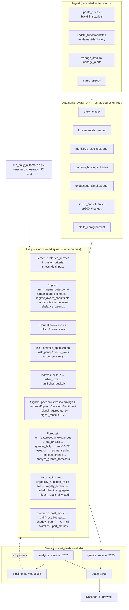

# System Orchestration

How the stock_monitor programs chain together: data in → analytics → dashboard. Read this before running anything in production, and before asking an agent to "run the analytics."

## 0. System architecture



> Two equivalent entry points drive the analytics loops: `run_daily_automation.py`
> (CLI) and `analytics_service.py`'s `POST /run/all-daily` (dashboard). Both run
> the same ordered jobs; choose whichever fits the context.

## 1. The data spine (shared inputs)

Almost every program reads from a small set of canonical parquet/CSV tables in `DATA_DIR` (loaded via `data_access.py`). Change these and everything downstream moves:

| Table | Written by | Read by |
|---|---|---|
| `daily_prices/` | `update_prices.py`, `backfill_historical.py` (yfinance), `update_polygon.py` (key-gated) | Fisher indexes, TTM/forecasts, correlations, risk, backtests |
| `fundamentals.parquet` | `update_fundamentals.py` (`fetch-history`), `backfill_edgar.py` (SEC XBRL), `fundamentals_history.py` | screens, preferred_metrics, inclusion, dupont |
| `monitored_stocks.parquet` | `manage_stocks.py` | index builds, ticker resolution, screens |
| `portfolio_holdings.parquet` | external/Robinhood export | portfolio_report, risk, optimization |
| `trades.parquet` | external (Robinhood fills) | portfolio_report, perf vs benchmarks |
| `sector_prices.parquet` | `cross_asset_analysis.py save-sector-prices` | exogenous features, forecasting |
| `exogenous_panel.parquet` | `ttm_exogenous.py` | Granite TTM forecast channels (market/sector returns, dispersion) |
| `granite_series_cache.parquet` | `granite_daily.py` | cached series for the daily forecast loop |
| `earnings_calendar.parquet` | `update_earnings.py` | earnings_catalyst, economic_calendar |
| `estimate_revisions.parquet` | `estimate_revisions.py` | consensus EPS/price-target revision signals |
| `sp500_constituents.parquet` | `parse_sp500.py` | S&P tracking (`sp_universe_tracking`, `sp_index_methodology`) |
| `sp500_changes.parquet` | `parse_sp500_changes.py` / `parse_tickerleague_changes.py` | S&P add/remove event log (`sp_index_methodology`, `sp_history_simulation`) |
| `alerts_config.parquet` | seed / `manage_alerts.py` | `check_alerts.py` |

> Schema details for every output above (and the ~200 others) live in [SCHEMAS.md](SCHEMAS.md). The dashboard exposes 198 resources (`dashboard_data/data_catalog.json`).

## 2. The pipeline (a typical day)

```
                         ┌─────────────── ingest ───────────────┐
   yfinance ──► update_prices.py  /  backfill_historical.py ──► daily_prices/
   manual   ──► update_fundamentals.py / fundamentals_history.py ──► fundamentals.parquet
   roster   ──► manage_stocks.py ──► monitored_stocks.parquet
                         └─────────────────────────────────────┘

              ┌────────────── analytics (maintain_analytics.py hub) ──────────────┐
   screens:   preferred_metrics → inclusion_criteria → stress_dual_pass
   indexes:   build_index / build_growth_tech_index / build_defensive_index → fisher_index (run_fisher_duckdb)
   risk:      portfolio_optimization / risk_parity_analytics / robust_covariance / vol_target / kelly
   regimes:   hmm_regime_detection → regime_correlation_breakdown / regime_aware_constraints / kalman_state_estimates
   corr:      allpairs_correlations / crisis_correlation / cross_asset_analysis / rolling_*
   signals:   peer_analytics / pair_engine / cross_section / earnings_catalyst → signal_aggregator (+ signal_model)
   forecasts: ttm_features + ttm_exogenous → granite_backfill/ttm_backfill (pretrain) → granite_daily → pass6/7/8 (regime models) → regime_serving → forecast_granite
   taleb:     tail_index → ergodicity_ruin · gap_risk + tail_index → fragility_screen → barbell_check · aggregate + preferred → hidden_optionality_audit
   execution: cost_model (in pair/cross) · shadow_book (paper) · perf_metrics
              └────────────────────────────────────────────────────────────────────┘

              ┌────────────── publish ──────────────┐
   export_dashboard_data.py ──► dashboard_data/data.json  (+ build_data_catalog.py → data_catalog.json, 198 resources)
              └─────────────────────────────────────┘
```

`run_daily_automation.py` is the master orchestrator — 37 jobs in dependency waves (hmm → rebalance; preferred → inclusion/stress/risk_enrich/rolling/rolling_corr/allpairs/screen_bt/dupont/growth/peer/taleb_tail/taleb_gap; growth+peer → earnings → pairs → cross → aggregate → technical → taleb_optionality; taleb_tail → taleb_ergodic → taleb_fragility (with taleb_gap) → taleb_minsky → taleb_shock → taleb_sector_shock → taleb_shock_ride → taleb_subindustry_regime → taleb_barbell; econ_cal/est_rev independent; shadow after preferred+aggregate; export last). Use it instead of calling steps by hand.

## 3. Services (started by `start_dashboard.sh`)

`start_dashboard.sh` launches **four** processes and a static file server, then blocks until Ctrl+C (which kills all four). Ports are env-overridable:

| Process | Port (env) | Role | Doc |
|---|---|---|---|
| `export_dashboard_data.py` (+ `build_data_catalog.py`) | — | writes `dashboard_data/data.json` + `data_catalog.json` at startup | [export_dashboard_data.md](export_dashboard_data.md) |
| `granite_service.py` | 5055 (`PORT_API`) | live Granite/fallback forecasts (HTTP) | [granite_service.md](granite_service.md) |
| `pipeline_service.py` | 5056 (`PORT_PIPE`) | job runner: rerun prices/backfill/analytics/export/forecast_bt/monte_carlo/all as subprocesses | [pipeline_service.md](pipeline_service.md) |
| `analytics_service.py` | 8767 (`PORT_ANALYTICS`; script default 8765) | dashboard ops hub: trigger daily jobs (`POST /run/all-daily`, `/run/update-prices`, `/run/preferred-metrics`, `/run/rolling`, `/run/export-dashboard`, …), read tables, data-integrity | [analytics_service.md](analytics_service.md) |
| `python -m http.server` | 8765 (`PORT_WEB`) | static dashboard (`index.html`) | — |

> The script default for `analytics_service` is **8765**; `start_dashboard.sh` overrides it to **8767** so the static server can keep 8765. If you launch `analytics_service.py` by hand, it listens on 8765 unless you pass `--port`.

After launch:
- Dashboard: http://127.0.0.1:8765/index.html
- Forecasts API: http://127.0.0.1:5055/health
- Pipeline jobs: http://127.0.0.1:5056/jobs
- Analytics API: http://127.0.0.1:8767/health

## 4. Forecast subsystem (Granite TTM)

Forecasts are the most stateful part. Order matters:

1. **Build panels**: `ttm_features.py` (multivariate panels from `daily_prices`) + `ttm_exogenous.py` (market/sector/dispersion channels → `exogenous_panel.parquet`).
2. **Pre-train** history once (or when data grows): `ttm_backfill.py` / `granite_backfill.py` (thin shim) / `train_adjusted_full.py` (adj-close config) produce global adjusted checkpoints under `checkpoints/`. `window_padding.py` pads sub-512-day tickers with a rescaled market proxy so the fixed 512-token TTM context is valid.
3. **Daily**: `granite_daily.py` runs the 512→96-day model with continual retraining on prior-day actuals (caching series in `granite_series_cache.parquet`); `forecast_granite.py` produces `forecasts_granite.csv/.parquet` used by `granite_service.py`.
4. **Regime-selected research**: `pass5.py`/`pass5_sweep.py` establish direction beats persistence (honest OOS, temporally disjoint); `pass6.py` fine-tunes one model per HMM regime and selects the best config per (ticker, regime) into `regime_model_best.csv` (per-span direction `dir_acc_h10..h96`; `--head-only` freezes the backbone per the TTM paper, `--exog` adds a calendar-event channel, `--rpt` probes RPT compatibility and degrades truthfully); `pass7.py` runs the experiment-design matrix (boundary/composition/lr/freshness) confirming robustness; `pass8.py` pre-trains our OWN RPT-enabled base (`num_patches=9`, `freq_token=8` daily) and fine-tunes from it. Run manually on GPU; checkpoints land in `checkpoints/regime/` via `pass6.py --ckpt-dir`.
5. **Serving**: `regime_serving.py` reads the current HMM regime + `regime_model_best.csv` and returns the matching checkpoint; `forecast_granite.py` **ensembles** it (0.5 general + 0.5 regime) when available, and can emit MC-dropout std bands (`--uncertainty`) as a **Student-t predictive** (`forecast_nu` from sample kurtosis — the Forecasting-Paradox scale-mixture result), an optional **dial of doubt** (`--epistemic-error EPS` widens the band by the 50/50 σ(1±EPS) mixture), per-span direction (`regime_dir_h10..h96`), and staleness flags. `regime_calibrate.py` checks the band's z=1 coverage (68% = honest) and batch-trains uncovered tickers (`--train`).
6. **Score**: `analyze_granite_forecasts.py` backtests the forecasts (writes `forecast_backtest_metrics.csv/.parquet`), annotates `signal_gated` BULL*/BEAR* against per-regime persistence baselines, and reports the regime-selected model's expected edge; `forecast_reliability.py` ranks setups on the actual holdings; `research_hygiene.py` reports reliability.
7. **Anomalies**: `tspulse_anomaly.py` scans for outliers.

Checkpoints live under `checkpoints/` (Git-ignored / large). Never delete them mid-run.

## 5. S&P tracking subsystem

Independent reimplementation of S&P 500 inclusion/exclusion, scored against actuals:

`parse_sp500.py` → `sp500_constituents.parquet` → `parse_sp500_changes.py` / `parse_tickerleague_changes.py` (event logs) → `sp_index_methodology.py` (reimplementation + tiers) → `sp_universe_tracking.py` (503-constituent tracking) → `reconcile_sp500.py` (fix `monitored_stocks`).

## 6. What an agent should know before "running analytics"

- Always start from `run_daily_automation.py` (or the dashboard's `analytics_service` → `/run/all-daily`), not individual scripts. Valid job names (37): `hmm, rebalance, preferred, inclusion, stress, crisis, factor_rot, risk_enrich, rolling, rolling_corr, tail_hedge, allpairs, fund_snap, screen_bt, dupont, growth, peer, earnings, pairs, cross, aggregate, technical, econ_cal, est_rev, shadow, taleb_tail, taleb_gap, taleb_ergodic, taleb_fragility, taleb_minsky, taleb_shock, taleb_sector_shock, taleb_shock_ride, taleb_subindustry_regime, taleb_barbell, taleb_optionality, export`.
- Data must be fresh: if `daily_prices/` is stale, run `update_prices.py --fetch --days N` first.
- The dashboard reads `dashboard_data/data.json`; if tables look empty, re-run `export_dashboard_data.py`. The dashboard exposes 198 resources (catalog in `data_catalog.json`).
- Don't hand-edit the base parquet tables; use the dedicated writer scripts (`manage_stocks`, `update_fundamentals`, `update_prices`).
- Forecasts need pretrained checkpoints; if `forecasts_granite.parquet` is missing, run `granite_backfill.py`/`ttm_backfill.py` then `granite_daily.py`.
- Regime-selected serving is a GPU research path: `pass6.py --ckpt-dir checkpoints/regime` retrains the per-regime models; `regime_serving.py` (no args) prints the serving plan. Tickers without coverage keep the general model — that is the intended degradation.
- Signal aggregation runs inside the daily DAG (`aggregate` job); `signal_aggregator.py --save` re-runs it alone. The composite feeds `buy_candidates.py` and `shadow_book.py`.
- `buy_candidates.py` decisions are **noise-robust**: the stress haircut reads the HMM posterior `p(stress)` (soft stress — `regime_stress_prob()`), and every numeric driver's contribution is the noise-convolved expectation `E[g(x+ε)]` (`_step_expectation` + the `*STEPS` configs, widths from `_est_error`). `hidden_optionality_audit.py` re-measures decision flip rates daily (the `taleb_optionality` job); if a driver's flip rate climbs, stochasticize it before trusting the decisions.
- Full program catalog with cross-links: see each `docs/<script>.md` and [SCHEMAS.md](SCHEMAS.md).
