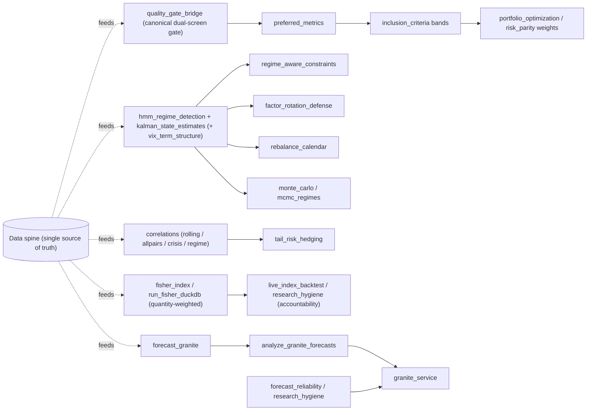

# Stock Monitor — System Overview & Investment Thesis

*Living document for the portfolio intelligence stack built across this project.*

---

## 1. What we built

A **modular, offline-capable investment operating system** around a real Robinhood book (staples, healthcare, materials/fertilizer, telecom, and a high-vol growth name), expanded into:

| Layer | Role |
|-------|------|
| **Data** | `trades`, `daily_prices`, `fundamentals` (dated, EDGAR-deep), `monitored_stocks`, index levels |
| **Screens** | Value trifecta, Buffett quality, dual-pass INCLUDE_CORE (+ quality-trend guard), near-dual, inclusion/exclusion |
| **Risk** | Vol targeting (per-name caps), ERC / inverse-vol / GMV, robust covariance, Kelly helpers |
| **Regimes** | Rolling corr, ALLPAIRS, crisis corr breakdown, HMM/Kalman/VAR (earlier threads) |
| **Signals** | Preferred/peer/cross/pairs/earnings → OOS-IC-weighted aggregator (+ per-regime IC), GBM blend, technical, options skew, revisions, filings sentiment |
| **Forecast** | Granite TTM-style path, exogenous features, anomaly scans, microservice, **regime-selected serving** (pass5/6/7/8 → checkpoints → ensemble) |
| **Indexes** | Fertilizer, defensive value, personal, growth/tech |
| **Allocation** | Factor rotation (quality/value/dual/low-vol/dividend), tail hedges, Black–Litterman |
| **Execution** | Cost model (10bps + borrow), shadow book (FIFO lots + kill switches), perf metrics (Calmar/capacity) |
| **Taleb layer** | Fat-tail index, gap risk, fragility screen (micro) + **macro debt fragility (Keen/Minsky)** + **macro supply shock (oil/inflation) + sector shocks (farming/materials)**, ergodicity/ruin, barbell check, **hidden-optionality audit** (decision-flip rates), Forecasting-Paradox uncertainty (Student-t predictive + dials of doubt) |
| **Ops** | Alerts (price + fundamentals), daily automation (37 jobs), DuckDB-Wasm dashboard, analytics API |

It is designed so **screens, risk budgets, and regime signals** can change weights over time—not a static “buy the trifecta and forget.”

### How the layers actually connect (the feedback loops)



The stack is not a linear pipeline; it is a set of loops that re-condition each other:

- **Screen → Policy → Weights.** `quality_gate_bridge` (the canonical dual-screen gate, mirrored from the `stockmagic` library) is the single source of truth for the Buffett-quality + value-trifecta legs. `preferred_metrics` → `inclusion_criteria` turn it into INCLUDE_CORE / VALUE / QUALITY / SATELLITE / WATCH / AVOID bands; `portfolio_optimization` / `risk_parity_analytics` turn those bands into target weights. Change a threshold in `threshold_logic` and the weights move.
- **Regime is the master switch.** `hmm_regime_detection` + `kalman_state_estimates` (triangulated with `vix_term_structure`) emit a regime label that drives **three** downstream consumers: `regime_aware_constraints` (which caps relax in stress), `factor_rotation_defense` (which sleeve is overweight), and `rebalance_calendar` (when to act — now with a **soft stress band** `1 − 0.5·p(stress)` instead of the hard half-band cliff). The same label feeds `monte_carlo` / `mcmc_regimes` so tail sims use regime-conditioned means. Since 2026-08, decision consumers read the HMM **posterior** (soft stress) rather than the hard label — the hidden-optionality audit showed the hard cliff flipped 28.4% of buy decisions on a small perturbation; the soft posterior cut that to ~1.6%.
- **Correlation structures the hedges.** Rolling / ALLPAIRS / crisis / regime-conditioned correlations all encode one fact: diversification fails in crises (calm pairwise ~0.15, crisis ~0.45+). That single observation is *why* `tail_risk_hedging`, `factor_rotation_defense`, and the cash buffer exist.
- **Index levels are the accountability layer.** `fisher_index` / `run_fisher_duckdb` (DuckDB is system-of-record) build quantity-weighted indexes from the same prices the screens use; `live_index_backtest` and `research_hygiene` then ask whether the screens actually beat a passive benchmark. The S&P tracking subsystem (`parse_sp500*` → `sp_index_methodology` → `sp_history_simulation`) is an independent reimplementation scored against S&P actuals — the same discipline applied to the index committee.
- **Forecasts are a stateful overlay.** `ttm_features`+`ttm_exogenous` → `ttm_backfill` (pretrain) → `granite_daily` (continual) → `forecast_granite` → `analyze_granite_forecasts` (score) → `granite_service`. The scoring loop (`forecast_reliability`, `research_hygiene`) closes the loop: bad configs get dropped before they reach the dashboard.
- **Regime selects the forecaster.** Research (`pass5`/`pass6`/`pass7`/`pass8`) proves Granite-TTM is a *direction* forecaster whose edge is regime-dependent; `regime_serving.py` turns that into production: the current HMM regime picks the per-regime checkpoint (`regime_model_best.csv`) and `forecast_granite.py` ensembles it with the general model, carrying per-span direction accuracy (H+10..96), MC-dropout uncertainty, and staleness flags. pass8 adds an **own RPT-pre-trained base** (`num_patches=9`, `freq_token=8` daily) so Resolution Prefix Tuning becomes usable (the IBM base wasn't RPT-pretrained; `--rpt` probes and degrades truthfully otherwise). pass6 `--head-only` (freeze backbone) and `--exog` (calendar-event channel) are the TTM-paper-aligned training modes.
- **Signals aggregate honestly.** Five signal families (preferred/peer/cross/pairs/earnings) plus technical/options/revisions/sentiment merge in `signal_aggregator.py` with **out-of-sample IC-derived weights** (per-regime since 2026-08) and a supervised `signal_model.py` blend — the composite feeds `buy_candidates.py`, the shadow book, and the regime-gated forecast annotations.
- **The Taleb layer is the uncertainty audit.** Fat tails are measured (`tail_index.py`), gaps (`gap_risk.py`), fragility (`fragility_screen.py`, a veto in buy decisions), ergodicity/ruin (`ergodicity_ruin.py`), and the barbell check (`barbell_check.py`). The **hidden-optionality audit** (`hidden_optionality_audit.py`) stochasticizes each decision driver by its own estimation error and measures decision flip rates — the American-options lesson applied to the stack. Two fixes came out of it: the **soft stress posterior** (buy_candidates reads p(stress) from the HMM instead of the hard label) and **noise-convolved expectations** (`_step_expectation` — every numeric driver's contribution is E[g(x+ε)] over its estimation noise, so a hair of noise can't flip a decision at a knife-edge). Forecasting uncertainty is Student-t (MC-dropout ν from sample kurtosis, `forecast_nu`) with an optional **dial of doubt** (`--epistemic-error`, the Forecasting-Paradox scale mixture).

The **data spine** (`daily_prices`, `fundamentals`, `monitored_stocks`, `portfolio_holdings`, `trades`, `exogenous_panel`, the S&P tables) is the only thing every loop reads; the **four services** (`granite_service` :5055, `pipeline_service` :5056, `analytics_service` :8767, static :8765 via `start_dashboard.sh`) are just the runtime that exposes these loops to the browser. See [SYSTEM_ORCHESTRATION.md](SYSTEM_ORCHESTRATION.md) for the exact chaining and [SCHEMAS.md](SCHEMAS.md) for every output.

---

## 2. What we are analyzing (and why)

### Valuation (trifecta)
- **EV/EBITDA ≤ 9** — operating value not overly rich  
- **P/B ≤ 1.5** — modest premium to book  
- **MktCap/Assets ≤ 0.5** — assets not fully priced away  

*Basis:* classic value; cheapness is necessary but not sufficient.

### Quality (Buffett-style)
- **ROE ≥ 15%, ROIC ≥ 15%**, **D/E ≤ 1**  
- DuPont: prefer ROE from **operations**, not leverage  
- Earnings stability as a predictability proxy  

*Basis:* durable economic returns compound; leverage-inflated ROE fails in stress.

### Dual-pass (INCLUDE_CORE)
All six legs. Empirically rare: quality is expensive; cheap names often have weak ROIC. Stress tests show the gate is stable (tight → 0 names; base → ~5 regional bank/AM names; relaxed → teens). A **quality-trend guard** (added 2026-08) demotes CORE when ≥2 of ROE/ROIC/earnings-stability deteriorated >30-50% across the fundamentals history — a name must still *be* high quality, not just have been.

### Risk & sizing
- **Volatility targeting** and per-name **weight caps** (gap/AI risk ≠ short-window σ)  
- **ERC** equalizes risk contribution; **GMV** minimizes vol; **inv-vol** is a simple diagonal ERC  
- Robust covariance (Ledoit–Wolf) stabilizes optimizers  
- Rolling vol, beta, max DD, CVaR on screens and stress tables  

### Correlation & regimes
- Rolling windows (21/63/126), ALLPAIRS history, crisis vs calm  
- In factor-structured data: calm pairwise ~0.15, crisis ~0.45+, sector crisis higher still  
- *Implication:* diversification **fails when you need it**; hedges and cash buffers matter  

### Factor rotation (defense)
Sleeves: quality, value, dual, low-vol, dividend ETFs, full defensive index.  
Risk-off → low-vol + dividend ETFs; risk-on → quality/dual; value tilt when value lags.

### Tail hedges
Cash 10–20%, low-vol tilt, defensive ETF blend, put-proxy, **tail_combo**.  
Cash and combo cut vol and max DD most cleanly in sample.

### Growth satellite
The growth/tech sleeve is a **capped satellite**, not the core — aerospace/space names and other high-vol growth sit here. ERC/GMV inside the sleeve; portfolio-level per-name/vol caps still bind.

---

## 3. What these goals/thresholds can achieve

| Objective | Mechanism |
|-----------|-----------|
| Avoid permanent capital loss | Quality + leverage limit + tail hedges |
| Buy under-earning assets | Trifecta + near-dual watchlist |
| Don’t overpay for quality | Dual-pass rarity forces “fair price” discipline |
| Contain idiosyncratic blow-ups | Name caps, vol targeting, satellite budget |
| Adapt to regimes | Corr/vol signals → factor rotation |
| Stay implementable | Parquet + CSV + dashboard + one daily script |

**They cannot:** guarantee outperformance, replace judgment on fraud/regulation/technology shifts, or make synthetic history into live edge. Thresholds are **policy**, not truth.

---

## 4. Beating the S&P 500 over ~10 years — a realistic design

S&P 500 is a **large-cap, momentum-tolerant, quality-growth-heavy** benchmark. Beating it after costs requires a *repeatable edge* and *risk discipline*, not constant high beta.

### Proposed dynamic fund architecture

1. **Core (60–75%) — Defensive compounders & dual/near-dual value**  
   - Dual-pass and INCLUDE_QUALITY at fair-or-better prices  
   - Trifecta value with acceptable ROIC  
   - Defensive ETFs (SCHD, VIG, XLP, XLU, USMV) as ballast  
   - Rebalance on screen changes + quarterly fundamentals  

2. **Flex value (10–20%) — Cyclical QARP**  
   - Energy/refiners, steel, select financials when near-dual and mid-cycle  
   - Factor rotation overweight when value lags quality  

3. **Growth satellite (5–15%) — Hard-capped**  
   - Growth/tech + aerospace/Starlink chain  
   - Per-name weight caps; sleeve vol budget  
   - Only add on drawdowns or improving quality metrics  

4. **Hedge / liquidity (5–15%)**  
   - Cash or short-duration ballast in high-corr/high-vol regimes  
   - Optional put-proxy or min-vol overlay when crisis corr spikes  

### Process (quarterly + monthly)
- Monthly: vol regime, rolling corr, factor weights, alerts  
- Quarterly: fundamentals history, dual/near-dual, inclusion tables, DuPont  
- Continuous: price/fundamental alerts, per-name/vol caps  

### Why this can work vs SPX (not a promise)
- **Avoid the left tail** of single-name and high-corr crises  
- **Buy dollars for 70¢** when trifecta + decent ROIC appear  
- **Pay up only for durable ROIC**, sized by quality_score  
- **Don’t let a satellite eat the fund** (the historical failure mode of “intelligent” growth sleeves)  

Edge is **process + discipline**, not a single factor.

---

## 5. Future work

### Better quant
- ~~Live fundamentals API (replace seeds/backfill noise)~~ **done** — yfinance `fetch-history` + SEC EDGAR XBRL backfill (9,340 rows, ~2006→2026)
- ~~Real crisis labels (2008, 2020, 2022) on long history~~ **thresholds found (2026-08)** — crisis labels derived from OUR data, not the papers. Using the market drawdown history (1962→2026, equal-weight index) as crisis ground truth and the `macro_fragility` signals read point-in-time (no lookahead) at each onset:
  - **Empirical threshold: `crisis_band` (debt impulse ≥ 0.20) preceded 6 of 7 US crises** (1987, 2000, 2008, 2020, 2022, 2026). The one miss (1973-74, impulse 0.162) was the pre-1980 low-debt era.
  - **Minsky-signal pctile ≥ 80% fired at 5 of 6 pre-2026 crises** (2008 was the extreme at 99th pctile, impulse 0.365).
  - **2011 eurozone is a genuine true negative**: impulse 0.087 (elevated, 20th pctile) — an external crisis our US-debt-driven signal correctly did not flag.
  - The `danger_zone` column already emits these labels daily; the **open** part is a permanent labeled-episode table (`crisis_labels.csv`: onset, trough, min-DD, signal readings) + a validation harness scoring the signal's crisis-detection hit rate / false-positive rate out-of-sample.
- ~~Options-based hedges (put spreads) vs put_proxy~~ **partial** — ATM IV + skew/put-call now tracked (`options_skew.py`); spread construction still open
- ~~Transaction-cost and tax-aware rebalancing~~ **done** — `cost_model.py` (10bps + borrow) threaded into pair/cross backtests; shadow book tracks FIFO lots
- Walk-forward dual-pass / rotation (no look-ahead) — **synergy: the crisis-label table gives walk-forward its validation epochs** (post-crisis holdout windows), and `danger_zone` can gate the dual-pass book into defensive mode the way the stress posterior already gates buys
- Shrinkage + Black–Litterman views from screens automatically
- Partial-duration or inflation factors for true multi-asset defense
- ~~Decision robustness to estimation noise~~ **done (2026-08)** — the hidden-optionality audit (American-options paper) and the soft-stress / noise-convolved fixes: buy decisions now read the HMM posterior and E[g(x+ε)] driver contributions; flip rates dropped from 28.4% (regime) / 6.8% (momentum) to ~1.6% / ~6% with the knife-edges gone
- **FF5 + Novy-Marx factor library** **done (2026-08)** — `factor_library.py` replicates FF5+MOM on our universe + Novy-Marx quality factors; `signal_factor_loadings.parquet` maps signal families to factor betas; `signal_aggregator.py --use-residuals` for factor-neutral scoring
- **Ilmanen 4-pillar expected returns** **in progress** — `expected_returns.py` implements carry/value/momentum/defensive decomposition; outputs `expected_returns_decomp.parquet`
- **Factor attribution** **done** — `factor_attribution.py` rolling FF5 regression on portfolio returns (bogle_tmi R²=0.61, alpha=16.8%, beta_MKT=0.1)
- Quality gate validation: our gate (ROE≥15%, ROIC≥15%, D/E≤1.0) aligns with Novy-Marx (63%ile profitability, 64%ile low accruals, 32%ile low leverage, 89%ile value) — 85 tickers pass full gate

### Deeper integration
- **Single “decision engine”** reading inclusion + risk + regime → target weights (closest current: `buy_candidates.py` merges HMM/RISK/AGG extras into the composite)
- Dashboard: one-click "proposed trades" vs holdings
- Unify Fisher, Granite forecast, and factor rotation on shared calendar
- Alerting when dual-pass set changes or crisis corr regime flips — **synergy: `danger_zone` band transitions are a natural alert** (e.g. `danger`→`crisis_band` fired 2025Q4; the last such transition preceded the 2026 drawdowns). A crisis-correlation monitor (rolling_correlation_windows already exists) fed by the same crisis labels would complete the loop.
- ~~Paper-trade ledger with slippage vs SPX/SPY~~ **done** — `shadow_book.py` (buy_candidates targets replayed against realized prices, FIFO lots, kill switches)

### Data integrity
- Price pipeline health checks (the independent-synthetic corr ≈ 0 failure mode)
- Factor-structured or vendor data as default for regime research
- **LLM forecast brief is starved of coverage, not of ideas.** `forecast_llm.py` can only cite what is dense, ticker-keyed, and wordable. On disk (2026-08-29) these layers are too thin or too easy to misread to drive a desk note:
  - **Earnings mix:** `gains_strategic_investments` is filled for CRM only until a universe `edgar_companyfacts_v2` backfill. 61% of latest names with both NI and OI have |NI−OI|/|OI| > 25%; without SI/marks the model treats the gap as cash generation (CRM Q2: NI $3.53B vs OI $2.33B, marks +$2.61B). 3B still flipped burn/shortfall into “discipline” (ANGH 61% cash burn).
  - **Screen/policy:** `buy_candidates` is 552 names (PARA missing). `implied_r_screen` is 470 and leaked **RAL implied r −21.9%** — the ROE>0 and P/B>0 gate in the plan is not holding on the file. `preferred_metrics.decision` covers the universe and is the usable policy label.
  - **RIP panels that look rich but are not brief-ready:** Ilmanen ER (`expected_returns_decomp`, 9,026 names last date) is 0–1 ranks — word top/bottom third, never dump the number. Cochrane CF vs DR (`implied_r_decomp`, 8,669 names) has CF>DR on **0.7%** of rows — not a discriminator. `regime_clusters.peer_group` now falls back to GICS on `mixed_*` and sector-mismatch (AAPL → Technology); still too coarse for the desk note. `ride_book` is 9 names. `fragility_veto` is 13 names (SMCI). Dynamic aggregator Sharpe −0.14 — do not size, do not cite 0–1 family scores (3B reads them as percents).
  - **Taleb / ride:** `shock_ride_tickers` ~494 names (AAPL-only in the LLM sample). `fragile_flag` is ~10% and none of the mega-caps. Gap/Hill tails exist but are not yet a one-line veto the model won't invert.
  - **Fundamentals holes:** `revenue_yoy` / `revenue_qoq` / `ebitda_ttm` / `prior_estimate_*` are empty on the panel (0 latest). `ev_ebitda` on `fundamentals.parquet` is **824 / 9,345 = 8.8%** notna (the preferred snapshot is denser). Latest Unclassified life-cycle is still ~half the universe (missing TTM / short history / Damodaran mid-gap).
  - **Quality 0:** latest **4,161 / 9,345** score 0/100; **325** are ≥50. 1B called 0 “excellent.” Gate is ≥50 in the brief; the score itself needs a real floor, not a recitable zero.
  - **Horizon:** HMM is market-level, not per-ticker. Adaptive persist vs vol is **−0.074** (bar +0.60 fail). Do not expect the GGUF to infer a validity interval from calm-tape vol. Stamp `horizon_days` in Python or expand a per-name vol/ride series first.
  - **Sector / macro — keep out of the brief (measured 2026-08-30).** Date-identical tape is the vol/regime failure (same 6.9% vs 12.6% on all 16 → calm→buy). `macro_shock` last **2026-07-01 elevated**; ERP **4.23%** as of **2026-01-01** is already inside WACC / cost-of-capital. `economic_calendar` is **263 / 353** option-expiry rows, not a CPI print. `exogenous_panel` last **2026-07-28** vs prices/HMM **2026-08-24** (stale ~1 month); one exo day has Communication Services **+9.3%**. `sector_prices` levels are unusable (2026-07-30 close: Health Care **−0.000123**, Industrials **181,957**, Discretionary **0.17**); `sector_performance_summary` IT YTD **−99.8%**, Industrials **+2,774%**. GICS labels are coarse and sometimes wrong (PARA → Technology / Software-Application; META → Communication Services). `peer_group` mixed_* is gone (GICS fallback) but still too coarse for the desk note. Come back: rebuild sector EW **returns** from `daily_prices` (not those levels), then consider name-vs-home-sector 21d only when the gap is large. Do not add ERP/oil/CPI/HMM as a second copy of the cost-of-capital line.
  - **Fair EV/EBITDA (gated 2026-08-29):** negative Gordon multiples are NaN (MOS −14.4 was g 2% / ROIC 0.81%, reinvestment 2.47). Latest positive **486 / 9,345**. Do not add a provenance sister for a g/ROE path that no longer writes — NaN is the provenance. Remaining silent fill is **g**, not the multiple: **461 / 486** latest positives have `implied_growth = 0.02` from `fillna`. Tag that if anything.
  - **MoS leftover:** `mos_pass` requires `fair_ev_ebitda > 0` **and traded `ev_ebitda > 0`**. KHC −13.58 / SNDK −560.83 were the leftover; gated in `preferred_metrics.py` and omitted from the LLM brief.
  - **Book life-cycle:** BAYRY / HMC / HPQ / T latest **Unclassified**. BAYRY has no SEC CIK (ADR → BAYN.DE). HMC/HPQ/T need a Damodaran-gap diagnosis, not another classifier tweak. Unclassified universe still **4,991 / 9,345 = 53.4%** after TTM 76.7%.
  - **SI cache:** `companyfacts_cache/` is **1 file** (CRM). Universe SI backfill not launched.
  - **LLM series:** `forecast_llm.py` writes **last HMM date only** (no `--lookback` date loop). Default universe is the coverage-gated set (**365**). Stratified test was **16×1 date** (2026-08-24). Conformal stays blocked until a multi-date series exists. 3B default; `max_tokens=120`; live prompts ~297–385 tokens inside `n_ctx=1024` (headroom ~520). Stay **one-shot**. Do not let the GGUF write the operating brief. Press is a sidecar (`ticker_news_notes.parquet`) — one gated sentence, not a reason to own. Python owns the dossier. Do not spend headroom on sector/macro tape or unitless scores.
  - **Coverage-gated desk-note universe:** classified stage + 3y growth + FCF + ROIC−WACC on the same `as_of_date` is **365** latest names (was 413). Default CLI with no `--tickers` runs that set.
  Expand these files (full-universe SI, implied-r with the ROE/P/B gate actually applied, ride, buy_candidates; worded aggregator and ER ranks; TTM/yoy on the panel; drop `fillna(0.02)` on implied growth; gate `mos_pass` on traded EV/EBITDA > 0; rebuild sector EW returns from `daily_prices`) before adding more prompt fields. Do not add date-identical macro.

### Architecture gaps (known, not yet built)

These are concrete holes in the current architecture, distinct from the research wish-list above:

- **Per-ticker live-data joins are not wired.** Several analytics were originally written to join against a single stand-in ticker and were later generalized to apply uniformly, but the *proper* join of each analytic back to every ticker's live data (prices, fundamentals, forecasts, screens) does not yet exist. Today each program re-reads the spine tables directly; there is no shared "join analytics to all tickers' current state" layer. This is the next integration step before a single decision engine.
- **No single decision engine.** Screens, risk, and regime each emit their own outputs; nothing yet reads inclusion + risk + regime together and emits one target-weight set. `portfolio_optimization` / `risk_parity_analytics` consume the bands manually. `buy_candidates.py` is the closest partial (composite + gates + soft stress + de-noised drivers), but the full loop is not closed. **Synergy: the macro layer (`macro_fragility` danger_zone / Minsky signal) is a fourth input class the decision engine should read** — a macro risk-budget gate in the same spirit as the soft-stress posterior, not another per-ticker driver.
- **DuckLake not yet adopted.** `fundamentals_history.py` keeps dated snapshots and `backfill_*` captures history, but the large time-series tables are still committed as full parquet snapshots (per the data-versioning decision record). The planned DuckLake catalog for versioned PIT history is not implemented.
- **Forecast → screen feedback is still mostly one-directional.** Regime-selected serving (pass6/7/8 → `regime_serving.py`) now makes the forecast *regime-aware* and the signal aggregation is consumed by `buy_candidates.py`, but forecast direction does not yet re-weight the screen bands or risk budgets directly — it annotates the dashboard overlay and the candidate list. The forecasting-paradox upgrades (`forecast_nu`, `--epistemic-error`) make the forecast *uncertainty* honest, but it still doesn't drive allocation.

---

### Research Integration Plan (Phase 1 Priority Deep Dives)

Source of truth: [RESEARCH_INTEGRATION_PLAN.md](RESEARCH_INTEGRATION_PLAN.md). Status here is the **measured** gate, not the wish-list checkbox. Close is still fail when the bar is missed.

| # | Researcher | Status | Measured |
|---|------------|--------|----------|
| 1 | Fama/French + Novy-Marx | Closed (2026-08-23) | Gate ∩ NM **63%** (bar 80% **fail**). Residual IC **+0.0117** (bar +0.02 **fail**). Do not loosen 15/15/1.0. |
| 2 | Ilmanen + Ang | Active | 4-pillar ER on disk (9,026 last date). OOS hit-edge **+6.3pp pass**; top−EW **+1.4% fail**. Word top/bottom third in the brief; never dump 0–1 ranks. CF>DR **0.7%** — not a discriminator. |
| 3 | Asness/Pedersen | Active | Sharpe dyn−static **−0.14** (1.41 vs 1.55, bar +0.15 **fail**). Do not size on `--dynamic`. Do not put 0–1 aggregator scores in the LLM brief. |
| 4 | Taleb/Spitznagel/Haghani | Started | Hill veto **13 names** (SMCI). 90/10 TMI/BPI barbell maxDD ratio **0.98** (bar <0.50 **fail**). `ride_book` **9**. Fragile ~10%. |
| 5 | López de Prado | Measured (2026-08-25) | CPCV − random **+0.1pp** (bar +3% **fail**). Regime clustering **+46.4%** full-universe **pass**. Does **not** replace HMM. `peer_group` falls back to GICS on `mixed_*` and sector-mismatch (AAPL → Technology, not `financial_services_76`). |
| 6 | Hoffstein/Vince | Started | 7-day glide luck **−50.8%** (bar 40% **pass**). LS median terminal **18.54** vs ERC **6.40**. Do not size live books at f=1.50. |
| 7 | Lo/Amodei | Started | Persist vs vol **−0.074** (bar +0.60 **fail**). Conformal **88.9%** vs 90% (**fail**). LLM desk note live (3B, last-date, coverage-gated **365**). Bands stay blocked until a multi-date series. |

LLM brief: Python owns the dossier. Do not LLM-write it. Do not spend the ~520-token `n_ctx=1024` headroom on unitless scores or sector/macro tape. Stay one-shot. Default run is last-date coverage-gated **365**.

---

## 6. Daily command

```bash
python run_daily_automation.py
# or selective:
python run_daily_automation.py --only inclusion,stress,rolling_corr,tail_hedge,export
```

37 jobs in dependency waves: hmm → rebalance; preferred → inclusion/stress/risk_enrich/rolling/rolling_corr/allpairs/screen_bt/dupont/growth/peer/taleb_tail/taleb_gap; growth+peer → earnings → pairs → cross → aggregate → technical → taleb_optionality → export; taleb_tail → taleb_ergodic → taleb_fragility (with taleb_gap) → taleb_minsky → taleb_shock → taleb_sector_shock → taleb_shock_ride → taleb_subindustry_regime → taleb_barbell → export; econ_cal/est_rev independent; shadow after preferred+aggregate. Full list in [run_daily_automation.py](../run_daily_automation.py) or `--help`.

Dashboard: `index.html` + `dashboard_data/data.json` (198 resources)
Services: `analytics_service.py`, `granite_service.py`, `pipeline_service.py`
Start everything: `./start_dashboard.sh` → http://127.0.0.1:8765/index.html (Ctrl+C stops all)
