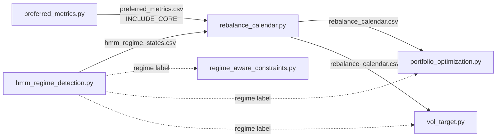

# rebalance_calendar.py

Regime- and dual-pass-aware rebalance schedule, with a **soft** stress band.

## Why it exists (rationale)

Rebalancing shouldn't be blind monthly. This builds a calendar of rebalance
dates (default: last trading day of month from the `daily_prices` calendar)
and scales the rebalance turnover band with the HMM stress **posterior**,
so the book isn't churned into a volatility spike — and the reduction is
proportional to how certain the regime model is, not a hard cliff.

## Formulas

**Trading calendar (month-end dates from `daily_prices.parquet`):**

Let $D = \{d_1, d_2, ..., d_N\}$ be the sorted unique trading dates from
`daily_prices.parquet`. Month-end dates are:

$$
\mathcal{E} = \left\{ \max\{d \in D : d \in \text{month } m\} : m \in \text{last } M \text{ months} \right\}
$$

**Stress probability (from HMM posterior):**

$$
p_t = P(\text{state} = \text{high\_vol\_stress} \mid \mathcal{F}_t)
$$

recovered from `hmm_regime_states.csv` columns `p_state_*` — the state
whose label contains "stress".

**Turnover band (soft, continuous in posterior):**

$$
\text{band}(p) = 
\begin{cases}
0.5 & \text{if } p \ge 0.99 \quad\text{(reduced\_rebalance)} \\
1 - 0.5 \cdot p & \text{if } 0.01 \le p < 0.99 \quad\text{(partial\_rebalance)} \\
1.0 & \text{if } p < 0.01 \quad\text{(full\_rebalance)}
\end{cases}
$$

- At $p = 1$ (certain stress): band = 0.5 (half turnover, matches old hard rule)
- At $p = 0$ (certain calm): band = 1.0 (full rebalance)
- Linear interpolation in between: $\text{band} = 1 - 0.5p$

**Action labels:**

| Action | Condition |
|---|---|
| `reduced_rebalance` | $p \ge 0.99$ |
| `partial_rebalance` | $0.01 \le p < 0.99$ |
| `full_rebalance` | $p < 0.01$ |

**Dual-core count (informational):**

$$
n_{\text{dual\_core}} = |\{i : \text{decision}_i = \text{INCLUDE\_CORE}\}|
$$

from `preferred_metrics.csv` where `decision == "INCLUDE_CORE"`.

## Why it exists (rationale)

Rebalancing shouldn't be blind monthly. This builds a calendar of rebalance
dates (default: last trading day of month from the `daily_prices` calendar)
and scales the rebalance turnover band with the HMM stress **posterior**,
so the book isn't churned into a volatility spike — and the reduction is
proportional to how certain the regime model is, not a hard cliff.

```mermaid
flowchart TB
  CAL[Month-end tick<br/>from daily_prices calendar] --> READ[Read inputs as of date]
  READ --> REG[Regime: hmm_regime_states.csv<br/>latest state <= date]
  READ --> PST[Stress posterior p(stress)<br/>from p_state_* columns]
  READ --> CORE[Dual-core count:<br/>preferred_metrics.csv INCLUDE_CORE]
  PST --> DEC{p vs thresholds}
  DEC -->|p ≥ 0.99| RED[reduced_rebalance<br/>turnover_band = 0.5]
  DEC -->|0.01 ≤ p < 0.99| PART[partial_rebalance<br/>turnover_band = 1 − 0.5·p]
  DEC -->|p < 0.01| FULL[full_rebalance<br/>turnover_band = 1.0]
  RED --> ROW[Write row: rebalance_date, regime, stress_prob,<br/>action, turnover_band, n_dual_core, notes]
  PART --> ROW
  FULL --> ROW
  ROW --> NEXT[Next month]
  NEXT --> CAL
```

> **Implemented (verified against source):**
> - Three actions — `full_rebalance` (p < 0.01), `partial_rebalance`
>   (0.01 ≤ p < 0.99, soft band `1 − 0.5·p`), `reduced_rebalance` (p ≥ 0.99,
>   half band 0.5).
> - The soft band came from the hidden-optionality audit: the old hard
>   "stress label → half band" cliff flipped 28.4% of decisions on a small
>   label perturbation. The band now scales continuously with the posterior.
> - `n_dual_core` counts `preferred_metrics.csv` rows with
>   `decision == "INCLUDE_CORE"` (today informational only).
>
> **Not implemented:** mid-month acceleration when the dual-pass set churns
> heavily (docstring intent only; `dual_core_tickers()` is read but no
> mid-month row is emitted).

### Feeder pipeline (analytics that feed the calendar)



**Notes (verified against source):**

1. **Regime input file.** Reads `hmm_regime_states.csv` (written by
   `hmm_regime_detection.py`); the same file is read by
   `regime_aware_constraints.py`, `monte_carlo.py`, `kalman_state_estimates.py`,
   etc. The stress probability is recovered from the `p_state_*` columns —
   the state whose label contains "stress" — not from the label alone.
2. **Calendar output is consumed.** `portfolio_optimization.py` and
   `vol_target.py` read `rebalance_calendar.csv` and apply `turnover_band`
   (0.5 at p≈1, 1.0 at p≈0, in between `1 − 0.5·p`) to cap weight drift vs
   current weights. The regime label also flows directly to
   `regime_aware_constraints.py`, `portfolio_optimization.py`, and
   `vol_target.py`.
3. **Wired into the daily loop.** `run_daily_automation.py` lists
   `"rebalance"` → `rebalance_calendar.py --months 18 --save` with
   dependency `rebalance: {hmm}` (runs after the regime fit, before the
   rebalance consumers). Uses **polars** (`pl.scan_parquet`) for the trading
   calendar; pandas for the regime/dual-core lookups.

## Usage

```bash
python rebalance_calendar.py --months 18 --save
```

Flags: `--months` (default 18), `--save`. Reads `daily_prices.parquet`,
`hmm_regime_states.csv`, `preferred_metrics.csv`.

## Outputs

- `rebalance_calendar.csv` — `rebalance_date, regime, stress_prob, action,
  turnover_band, n_dual_core, notes`

(Schema family: aux_table — see [SCHEMAS.md](SCHEMAS.md).)

## Related programs

- [hmm_regime_detection.md](hmm_regime_detection.md) — regime + posterior input
- [regime_aware_constraints.md](regime_aware_constraints.md)
- [portfolio_optimization.md](portfolio_optimization.md) / [vol_target.md](vol_target.md)