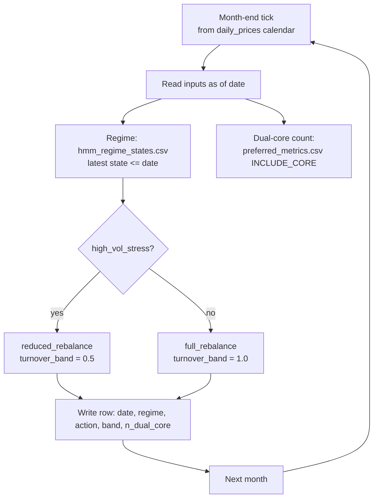
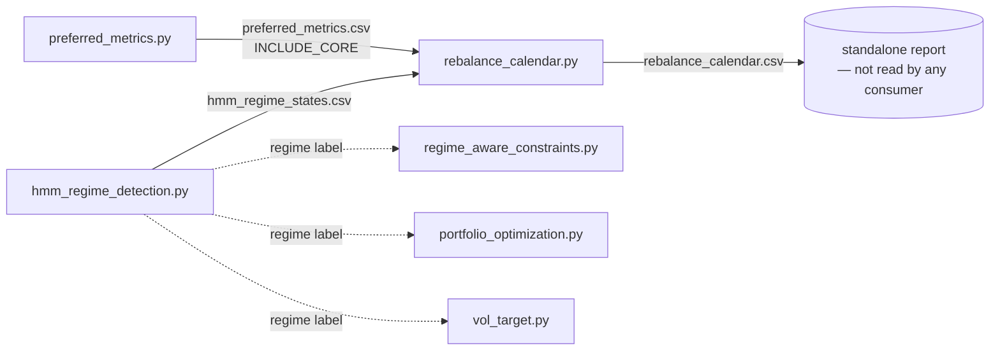

# rebalance_calendar.py

Regime- and dual-pass-aware rebalance schedule.

## Why it exists (rationale)

Rebalancing shouldn't be blind monthly. This builds a calendar of rebalance
dates (default: last trading day of month from the `daily_prices` calendar) and
reduces the rebalance to a half turnover band when the current regime is
`high_vol_stress`, so the book isn't churned into a volatility spike.



> **Implemented:** full vs reduced (half-band) rebalance driven by the latest
> `high_vol_stress` regime. **Documented but not yet in code** (docstring intent):
> skip-on-crisis and mid-month acceleration when the dual-pass set churns heavily —
> `dual_core_tickers()` is read but today only populates the `n_dual_core` column.
> Regime input: [hmm_regime_detection.md](hmm_regime_detection.md). Downstream
> consumers of the decision: [regime_aware_constraints.md](regime_aware_constraints.md)
> (cap relax) and [portfolio_optimization.md](portfolio_optimization.md) /
> [vol_target.md](vol_target.md).

### Feeder pipeline (analytics that feed the calendar)



**Correctness notes (verified against source):**

1. **Filename mismatch (fixed).** `rebalance_calendar.py` previously read
   `hmm_regimes.csv`, but `hmm_regime_detection.py` writes **`hmm_regime_states.csv`**
   (and `regime_aware_constraints.py`, `monte_carlo.py`, `kalman_state_estimates.py`,
   etc. correctly read that name). Nothing in the repo ever wrote `hmm_regimes.csv`, so
   `latest_regime_on()` returned `"unknown"` for every date, the calendar emitted
   `full_rebalance` always, and the `high_vol_stress` half-band never triggered. The
   same stale-name bug also affected `black_litterman_views.py` and `buy_candidates.py`.
   **Fixed:** all three now read `hmm_regime_states.csv`; the calendar now resolves
   `high_vol_stress` → `reduced_rebalance` (half turnover band) as designed.
2. **The calendar output is orphaned.** No downstream script reads
   `rebalance_calendar.csv`. The consumers that *should* act on regime —
   [regime_aware_constraints.py](regime_aware_constraints.md),
   [portfolio_optimization.py](portfolio_optimization.md),
   [vol_target.py](vol_target.md) — read the **regime label** (from
   `hmm_regime_states.csv`) or prices/holdings directly, not the calendar. So today
   the calendar is a reporting artifact, not an input to rebalancing.
3. **Not wired into the daily loop.** `run_daily_automation.py` does **not** list
   `rebalance_calendar.py` (or `hmm_regime_detection.py`) in its `JOBS`. Run the
   calendar explicitly after the regime + preferred feeds exist.

## Usage

```bash
python rebalance_calendar.py --months 18 --save
```

Flags: `--months` (default 18), `--save`. Reads `daily_prices.parquet`,
`hmm_regime_states.csv` (note: code currently points at `hmm_regimes.csv` — see
the feeder-pipeline gap above).

## Outputs

- `rebalance_calendar.csv` — scheduled rebalance dates + regime context

(Schema family: aux_table — see [SCHEMAS.md](SCHEMAS.md).)

## Related programs

- [hmm_regime_detection.md](hmm_regime_detection.md) — regime input
- [regime_aware_constraints.md](regime_aware_constraints.md)
- [portfolio_optimization.md](portfolio_optimization.md) / [vol_target.md](vol_target.md)
